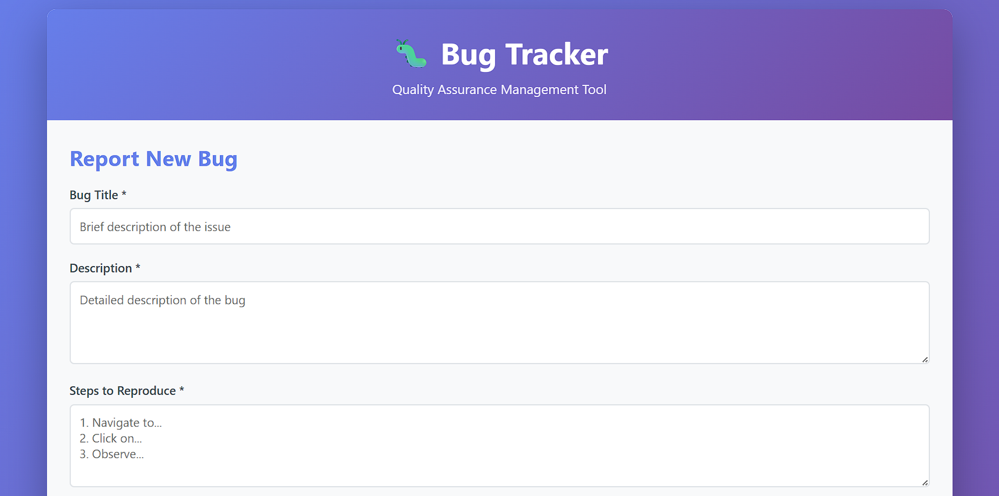
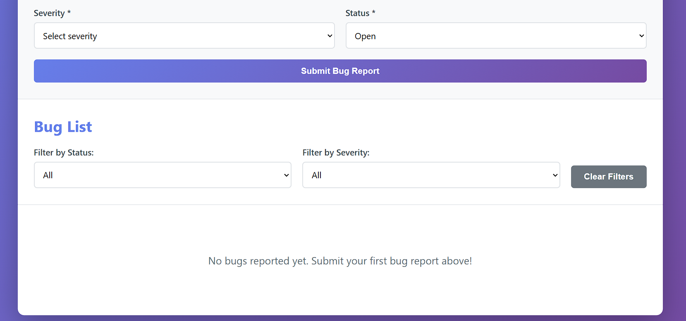
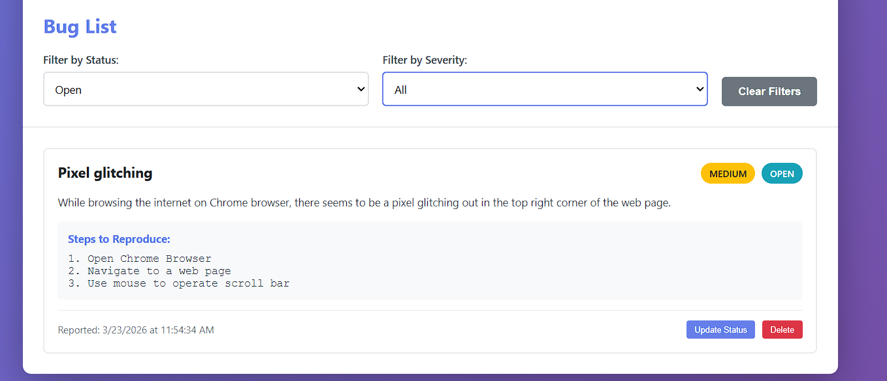
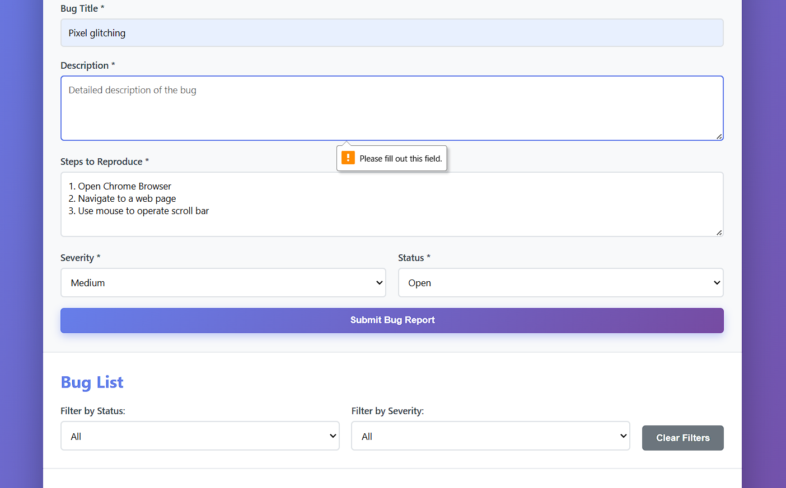

📌 Bug Tracker

A simple bug tracking web application that allows users to create, view, and manage issues. This project was built to better understand how bugs are reported and tracked in a development environment.

📸 Screenshot

 

🚀 Features

Create new bug reports
View a list of submitted bugs
Update bug status (e.g., open, in progress, closed)
Basic interface for tracking issues

🛠️ Technologies Used

HTML

CSS

JavaScript

🧠 What I Learned

How bug tracking systems are structured
The importance of clear and detailed issue reporting
Basics of building and organizing a web application
How small bugs can affect overall functionality

🧪 Test Cases

Test: Create a new bug report

Expected Result: The bug appears in the list with the correct title and status

Actual Result:

Test: Create a new bug report with intentional bug

Expected Result: An alert pops up with a message requesting a field be filled out

Actual Result:

▶️ How to Run the Project

- Download or clone the repository
- Open the `index.html` file in your browser
  
📌 Notes

This is a beginner project I created as part of learning software development and QA concepts. Future improvements may include better UI, additional features, and more structured testing.

